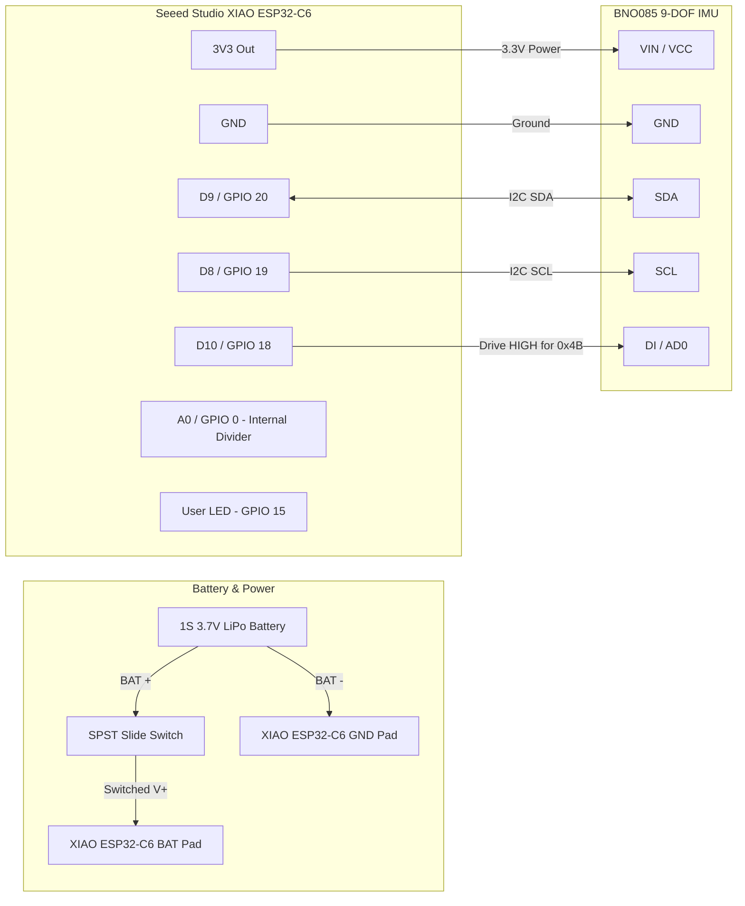

# Hardware & Wiring Guide — Pair Tracker WiFi

This guide documents the physical components, electrical schematic, wiring pinouts, battery monitoring, and assembly for a Pair Tracker WiFi node.

---

## 1. Bill of Materials (BOM)

To build a full 7-node body motion capture tracking set, you will need 7 individual tracker units plus strapping material.

### Per-Tracker BOM

| Component | Specification / Part | Qty | Purpose | Source / Notes |
|:---|:---|:---:|:---|:---|
| **Microcontroller** | Seeed Studio XIAO ESP32-C6 | 1 | WiFi 6 + BLE 5, RISC-V 160MHz, 4MB Flash, USB-C | [Seeed Studio](https://www.seeedstudio.com/Seeed-Studio-XIAO-ESP32C6-p-5884.html) |
| **IMU Sensor** | CEVA / Hillcrest BNO085 Breakout | 1 | 9-DOF IMU with onboard SH-2 sensor fusion (48 Hz) | Adafruit, SparkFun, or CJMCU BNO085 |
| **Battery** | 1S 3.7V LiPo (400 - 600 mAh) | 1 | Powers tracker node for ~3.5 to 5 hours | Standard 502535 / 602535 LiPo cell |
| **Power Switch** | SPST Micro Slide Switch | 1 | Physical power disconnect | 3-pin micro slide switch (e.g. SS12D00) |
| **Hookup Wire** | 28 AWG or 30 AWG Silicone Wire | ~1 m | Flexible, heat-resistant wiring | Stranded silicone wire |
| **Straps** | Elastic Hook-and-Loop (Velcro) | 1 | Fastens tracker securely to body segments | 38 mm or 50 mm wide elastic strap |
| **Enclosure** | 3D Printed PETG / PLA Case | 1 | Protects electronics and guides straps | STL files in `./reference/cad/` |

---

## 2. Wiring & Pinout Table

All pin definitions are confirmed against [`firmware/src/Hardware.h`](../firmware/src/Hardware.h) and [`firmware/src/IMUManager.cpp`](../firmware/src/IMUManager.cpp).

| XIAO ESP32-C6 Pin | GPIO | BNO085 Pin | Signal Type | Function & Behavior |
|:---|:---:|:---:|:---|:---|
| **3V3** | — | **VCC / VIN** | Power (3.3V) | Clean 3.3V regulated power from onboard LDO |
| **GND** | — | **GND** | Ground | Common reference ground |
| **D9** | **GPIO 20** | **SDA** | I2C Data | I2C Master Data line (400 kHz Fast-Mode) |
| **D8** | **GPIO 19** | **SCL** | I2C Clock | I2C Master Clock line (400 kHz Fast-Mode) |
| **D10** | **GPIO 18** | **DI / AD0** | Address Select | Driven **HIGH** on boot by firmware to select address **`0x4B`** |
| **A0** | **GPIO 0** | *(Internal)* | Battery ADC | Dedicated analog input via internal 1:2 voltage divider |
| **User LED** | **GPIO 15** | *(Onboard)* | Status Output | System status & identify indicator LED |
| *(None)* | — | **INT / RST** | Unused | Soft-reset over I2C; hardware interrupt not required |

> [!NOTE]
> **I2C Address Selection (`0x4B`):**
> The BNO085 default address is `0x4A` when `DI / AD0` is tied to ground, and `0x4B` when pulled HIGH. In [`firmware/src/IMUManager.cpp`](../firmware/src/IMUManager.cpp), GPIO 18 (`D10`) is initialized as an output and driven `HIGH` before initializing the I2C bus:
> ```cpp
> pinMode(I2C_ADR_PIN, OUTPUT);
> digitalWrite(I2C_ADR_PIN, HIGH);
> delay(10);
> Wire.begin(I2C_SDA_PIN, I2C_SCL_PIN, 400000);
> bno08x.begin_I2C(0x4B, &Wire);
> ```
> This ensures consistent detection across all breakout boards without requiring solder jumpers.

---

## 3. Electrical Schematic & Wiring Diagrams

### 3.1 Mermaid Wiring Schematic



### 3.2 ASCII Breadboard & Soldering Diagram

```
       +-------------------------------+
       |       1S 3.7V LiPo            |
       |  [+] Red          [-] Black   |
       +---|-------------------|-------+
           |                   |
         [Switch]              |
           |                   |
           v                   v
       (BAT Pad)           (GND Pad)
  +-----------------------------------------+
  |        Seeed Studio XIAO ESP32-C6       |
  |                                         |
  |  [USB-C Port]                           |
  |                                         |
  |  3V3  GND   D9/G20  D8/G19  D10/G18 A0  |
  +---|----|------|-------|-------|------|--+
      |    |      |       |       |      |
      |    |      |       |       |      +-> (Internal 1:2 ADC divider)
      |    |      |       |       |
      v    v      v       v       v
  +---|----|------|-------|-------|---------+
  |  VIN  GND    SDA     SCL     DI/AD0     |
  |                                         |
  |         BNO085 9-DOF IMU Board          |
  +-----------------------------------------+
```

---

## 4. Battery Monitoring & Power Management

### Internal 1:2 Divider
The Seeed Studio XIAO ESP32-C6 includes an onboard voltage divider connected between the battery terminal and `GPIO 0` (`A0`):
- High-side resistor: 100 kΩ
- Low-side resistor: 100 kΩ
- Division factor: $1:2$

As implemented in [`firmware/src/Battery.h`](../firmware/src/Battery.h):
```cpp
// 16-sample averaged analog reading in millivolts
uint32_t battMv = (totalMv * 2) / samples;
```

### LiPo Discharge Curve Mapping

$$\text{Percentage} = \frac{\text{Measured mV} - 3000}{4200 - 3000} \times 100\%$$

| Battery Voltage | Percentage | System State | Action |
|:---:|:---:|:---|:---|
| **$\ge 4.20\text{ V}$** | **100%** | Fully Charged | Normal operation |
| **$3.85\text{ V}$** | **~70%** | Nominal Voltage | Normal operation |
| **$3.60\text{ V}$** | **~50%** | Half Discharged | Normal operation |
| **$3.36\text{ V}$** | **~30%** | Low Battery Warning | OTA updates are blocked to prevent power loss during flash |
| **$\le 3.00\text{ V}$** | **0%** | Critical Low Voltage | Recharge immediately to avoid cell degradation |

---

## 5. Status LED Patterns

The Seeed Studio XIAO ESP32-C6 user LED is connected to **GPIO 15**. The firmware updates the LED according to network and command states:

| LED Pattern | Meaning | Technical State |
|:---|:---|:---|
| **OFF** | **Disconnected / Unpowered** | Device is powered off, booting, or attempting to join WiFi / resolving mDNS. |
| **SOLID ON** | **Connected & Streaming** | WiFi connected and WebSocket stream established with the server (`/v1/devices/{mac}/stream`). Active orientations streaming at 48 Hz. |
| **FAST BLINK** (~3.3 Hz, 150 ms toggle) | **Identify Command** | Triggered by clicking the **Blink** button on the dashboard card. Blinks for 3000 ms, then returns to previous connection state. |

---

## 6. Tracker Placement & Role Labeling

For accurate motion capture, each tracker must be physically fixed to the designated body segment. We recommend applying color-coded tape and printed labels to each tracker:

| Body Role | Role ID | Recommended Strap Placement | Color Code Suggestion |
|:---|:---:|:---|:---:|
| **`chest`** *(Required)* | 1 | Sternum / Upper Thorax center, facing forward | **Cyan** |
| **`left_thigh`** *(Required)* | 12 | Mid-thigh anterior/lateral side, above knee | **Green** |
| **`right_thigh`** *(Required)* | 13 | Mid-thigh anterior/lateral side, above knee | **Green** |
| **`left_shin`** *(Required)* | 14 | Lateral shin, midway between knee and ankle | **Teal** |
| **`right_shin`** *(Required)* | 15 | Lateral shin, midway between knee and ankle | **Teal** |
| **`left_foot`** *(Required)* | 16 | Instep / Upper bridge of left shoe | **Mint** |
| **`right_foot`** *(Required)* | 17 | Instep / Upper bridge of right shoe | **Mint** |
| `left_shoulder` | 2 | Upper clavicle / lateral acromion | Indigo |
| `right_shoulder` | 3 | Upper clavicle / lateral acromion | Indigo |
| `left_upper_arm` | 4 | Mid-bicep lateral side | Purple |
| `right_upper_arm` | 5 | Mid-bicep lateral side | Purple |
| `left_forearm` | 8 | Dorsal forearm, 5 cm above wrist | Lavender |
| `right_forearm` | 9 | Dorsal forearm, 5 cm above wrist | Lavender |
| `left_hand` | 10 | Back of hand / wrist strap | Magenta |
| `right_hand` | 11 | Back of hand / wrist strap | Magenta |

---

## 7. Battery Charging & Safety Notes

1. **Integrated USB-C Charging:**
   - The Seeed Studio XIAO ESP32-C6 features an onboard constant-current/constant-voltage (CC/CV) LiPo charging IC.
   - Charging automatically starts whenever the USB-C cable is connected.
   - An onboard red LED illuminates during charging and extinguishes when charging completes (~4.20V).
   - Maximum charge current is approximately **500 mA**.
2. **LiPo Handling Guidelines:**
   - Never puncture, crush, or bend LiPo cells.
   - Never leave charging trackers unattended on flammable surfaces.
   - If any battery appears swollen, puffed, or warm to the touch during standby, disconnect it immediately and dispose of it safely.
   - Always power off trackers using the physical slide switch when storing them for extended periods.
